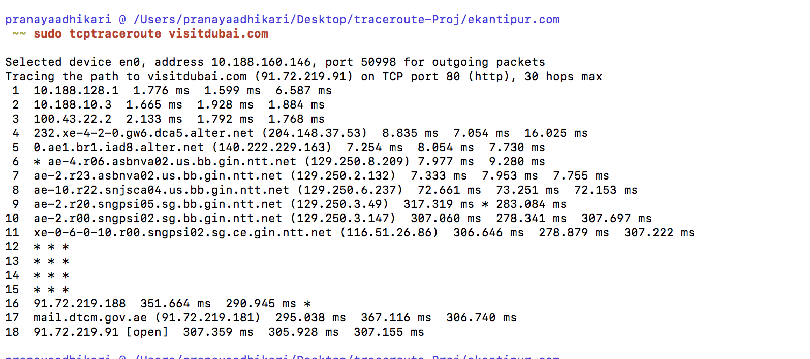
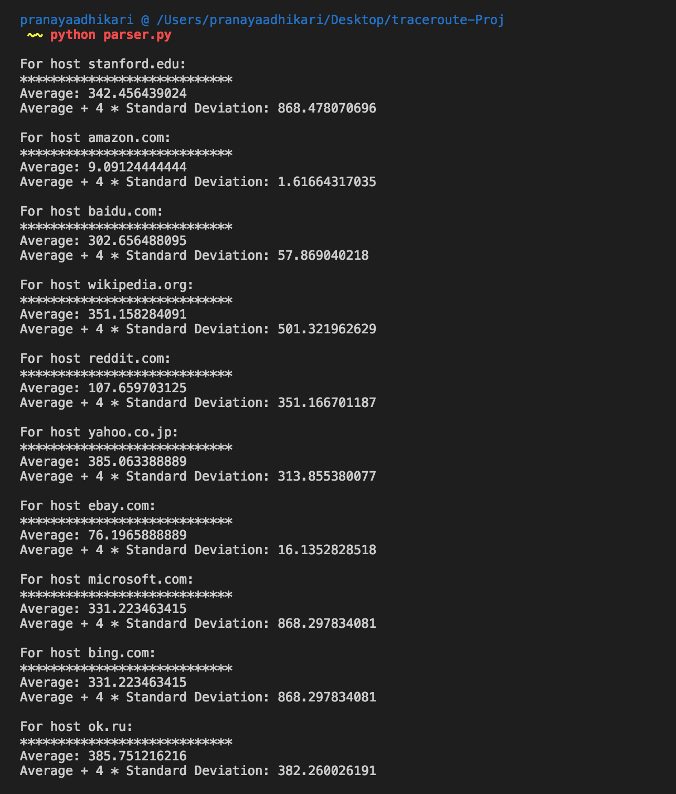
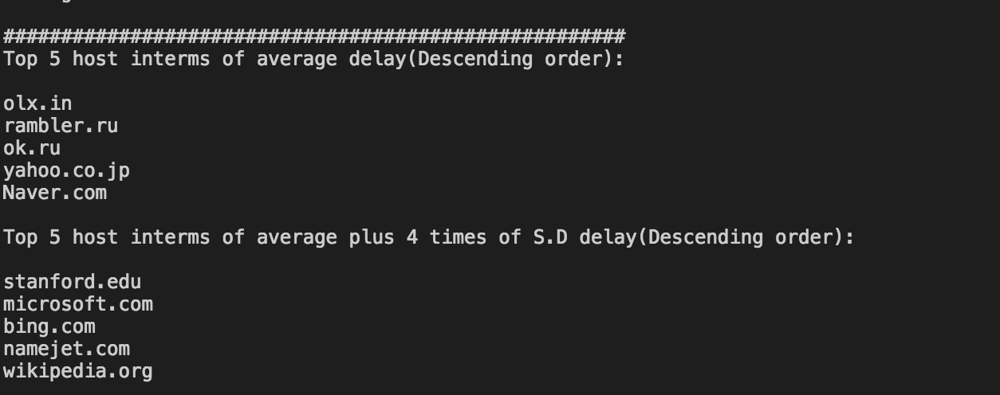

**Project Excerpt**

Traceroute is a simple program that can run in any Internet host. When the user specifies a
destination hostname, the program in the source host sends multiple, special packets toward that
destination. As these packets work their way toward the destination, they pass through a series of
routers. When a router receives one of these special packets, it sends back to the source a short
message that contains the name and address of the router.

**Objective of the Project**
The objective of the project is to understand the internet delays along the path towards the
destination host. The objective is also to know which host have longest delay along the end to
end path and state the reason of why such result is seen.

**Procedure**

Initially, I started the project out using ​ _traceroute hostname_ ​ for different hosts. But I soon
encountered the problem with different hosts using this approach. The problem is that with the
widespread use of firewalls on the modern Internet, many of the packets that traceroute sends
out end up being filtered, making it impossible to completely trace the path to the destination.
However, in many cases, these firewalls will permit inbound TCP packets to specific ports that
hosts sitting behind the firewall are listening for connections on. By sending out TCP SYN
packets instead of UDP or ICMP ECHO packets, ​ _tcptraceroute_ ​ is able to bypass the most
common firewall filters. So, I finally used ​ _tcptraceroute_ ​ command.
I ran my python script ​ _traceroute.py_ ​to simplify the need of manually typing command for each
host( 30 hosts) for 30 times, i.e total of 900 times. By the help of my script, I created one ​ _.txt_ ​ per
_tcptraceroute_ ​ command for every host. That made a total of 900 files, i.e 30 per host.

Then I used my python script ​ _groupby.py_ ​ to group those 900 files into 30 directories with 30 files
each. 30 files for each host(corresponding to the times​ _tcptraceroute_ ​ was ran on a single host)
was grouped in a directory named by the hostname. I also used regular expression matching for
this script.

Finally my python script parsar.py parsed all the files across those directories and calculated the
average delay time and average delay plus 4 times the standard deviation for each host. The
script prints out that information as well as top five hosts in terms of both average delay and
average delay plus 4 times the standard deviation. I used ​ _numpy_ ​ module to calculate average and
standard deviation.

**Figure 1: output of** ​ **_tcptraceroute visitdubai.com_**

**Results**

Below is the sample screenshot of the results obtained by running my script ​ _parser.py_ ​.

**Figure 2: output of my** ​ **_parser.py_**

**Conclusion**

From the above results top 5 sites that have highest average delays are:

1. olx.in
2. rambler.ru
3. ok.ru
4. yahoo.com.jp
5. Naver.com
All these websites or hosts are the ones which have servers located very farther from here. This
result totally makes sense as we would expect the host which are farther having huge delays.

Also the top 5 sites that have highest average delay plus 4 times of standard deviation are:

1. stanford.edu
2. microsoft.com
3. bing.com
4. namejet.com
5. Wikipedia.org

Also in Figure 1 we can see that the the round trip time(delay) increases by a huge difference
from 8th hop to 9th hop count. That is because of the transoceanic route it takes for that hop
count.

**References**
“FreeBSD Manual Pages.” Tcptraceroute,
[http://www.freebsd.org/cgi/man.cgi?query=tcptraceroute&manpath=FreeBSD%2B9.3-RELEASE%2B](http://www.freebsd.org/cgi/man.cgi?query=tcptraceroute&manpath=FreeBSD%2B9.3-RELEASE%2B)
and%2BPorts​.

Kurose, James F., et al. Computer networking: a top-down approach. Pearson, 2013.

